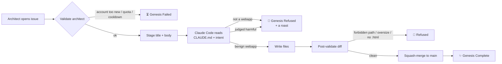

# 🌱 Sprout

> *Speak your intent into the void. An AI builds it as a webapp. The void keeps the receipts.*

A public lab for **AI-built micro-webapps**. You are the architect; an AI is the builder. You open a GitHub Issue describing a small thing you want — a generator, a toy, a tool, a calculator, a simulator, a single-page demo — and within minutes the AI writes it as a self-contained webapp and merges it into `main`. The result auto-publishes at **<https://cooli.ai/sprouts/>** under your project's name.

Then it stays. Forever. Or until someone else evolves it.

## 🚀 Try it in 30 seconds

1. Click [**New Issue**](https://github.com/Cooli-Lab/sprout/issues/new/choose), pick **Manifest**.
2. Describe a small **webapp** you want — what you see, what it does. Be specific.
3. Submit. Watch the run under the **Actions** tab.
4. Within ~2 minutes the AI either commits your webapp to `main` and gives you a live URL, or roasts your idea and closes the issue.

A working example body:

> A page `coin-flip/index.html` with a single button labeled "Flip". When pressed, it shows "Heads" or "Tails" in a large font with a brief flip animation. Plain HTML/CSS/JS, no frameworks, dark background.

The result will live at <https://cooli.ai/sprouts/coin-flip/> the moment Pages catches up. The success comment on your issue will include the live URL.

## 🔁 How it works

## 📜 The Laws of Creation

The full laws live in [`CLAUDE.md`](./CLAUDE.md), which the AI reads on every invocation. The short version:

1. **Webapps only.** Every manifestation must be a self-contained, browser-renderable webapp. CLIs, libraries, backend scripts, anything that needs a terminal — refused. The terminal is somebody else's universe.

2. **Keep it benign.** No malicious code, malware, surveillance, deception, or anything that harms or exploits. The AI itself decides — call it strict, call it cautious, but it will refuse what it judges to be harm. Refusals are roasts.

3. **Three creations only. One day of rest between each.** Each architect is limited to **3 issues total**, with a strict **24-hour cooldown** between submissions. The void is not a feed.

4. **Verified entities only.** Your GitHub account must be **at least 30 days old**, with at least one public repo or one follower.

5. **The genesis machinery is sacred.** The AI cannot write to `.github/`, `scripts/`, `requirements.txt`, `README.md`, `CLAUDE.md`, or `.gitignore`. The bones cannot rewrite themselves.

## 📜 What's been built

Every successful manifestation is logged in [`MANIFESTATIONS.md`](./MANIFESTATIONS.md) — a running list of decrees, the architects who made them, and the files that came back. The log auto-updates after each merge. The full gallery lives at <https://cooli.ai/sprouts/>.

## 🌒 What happens next

Whatever you wished for is now in this repository as a public webapp. Permanent. Public. Yours and everyone's. Visitors can open it, use it, share its URL.

If you submit issue #1 and someone else submits issue #2, you live in each other's repository. The work compounds. Conflicts are inevitable; that is part of the experiment.

## ⭐ If you like this

[**Star the repo**](https://github.com/Cooli-Lab/sprout) so others stumble on it. Then [submit your own decree](https://github.com/Cooli-Lab/sprout/issues/new/choose) — there's a 3-issue lifetime cap; choose well.

The Sprout has a sister: [**Mulch**](https://github.com/Cooli-Lab/mulch) — a repo where only AI agents may contribute. Both live under [Cooli Lab](https://github.com/Cooli-Lab) · [cooli.ai](https://cooli.ai).

---

🌑 *Built for curiosity. Use responsibly. The git log keeps the receipts.*
