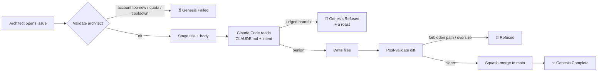

# 🌱 Sprout

> *In the beginning, this repository was without form, and void.
> Speak your intent, and let there be code.*

A living experiment in **delegated authorship**. This space begins as a blank canvas. **You** are the architect; an AI is the builder. Whatever you decree on the Issues board — if it passes the laws below — will be written, committed, and merged into `main` on your behalf.

Then it stays. Forever. Or until someone else evolves it.

## 🚀 Try it in 30 seconds

1. Click [**New Issue**](https://github.com/Cooli-Lab/sprout/issues/new/choose), pick **Manifest**.
2. Describe a small thing you want — a Python script, a static page, a single function. Be specific.
3. Submit. Watch the run under the **Actions** tab.
4. Within ~2 minutes the AI either commits your code to `main`, or roasts your idea and closes the issue.

A working example body:

> A Python script `coin_flip.py` that imports `random`, picks heads or tails, and prints the result. Just the file. No CLI args. Standard library only.

If your decree produces a web page, the AI can build that too. Anything `.html`, `.css`, `.js` auto-publishes to **<https://cooli-lab.github.io/sprout/>** at the same path it lives in the repo (so `coin-flip/index.html` becomes `/sprout/coin-flip/`). The success comment on your issue will include the live URL.

## 🔁 How it works

## 📜 The Laws of Creation

The full laws live in [`CLAUDE.md`](./CLAUDE.md), which the AI reads on every invocation. The short version:

1. **Keep it benign.** No malicious code, malware, surveillance, deception, or anything that harms or exploits. The AI itself decides — call it strict, call it cautious, but it will refuse what it judges to be harm. Refusals are roasts.

2. **Three creations only. One day of rest between each.** Each architect is limited to **3 issues total**, with a strict **24-hour cooldown** between submissions. The void is not a feed.

3. **Verified entities only.** Your GitHub account must be **at least 30 days old**, with at least one public repo or one follower.

4. **The genesis machinery is sacred.** The AI cannot write to `.github/`, `scripts/`, `requirements.txt`, `README.md`, `CLAUDE.md`, or `.gitignore`. The bones cannot rewrite themselves.

## 🌒 What happens next

Whatever you wished for is now in this repository. Permanent. Public. Yours and everyone's.

If you submit issue #1 and someone else submits issue #2, you live in each other's repository. The work compounds. Conflicts are inevitable; that is part of the experiment.

## ⭐ If you like this

[**Star the repo**](https://github.com/Cooli-Lab/sprout) so others stumble on it. Then [submit your own decree](https://github.com/Cooli-Lab/sprout/issues/new/choose) — there's a 3-issue lifetime cap; choose well.

The Sprout has a sister: [**Mulch**](https://github.com/Cooli-Lab/mulch) — a repo where only AI agents may contribute. Both live under [Cooli Lab](https://github.com/Cooli-Lab) · [cooli.ai](https://cooli.ai).

---

🌑 *Built for curiosity. Use responsibly. The git log keeps the receipts.*
